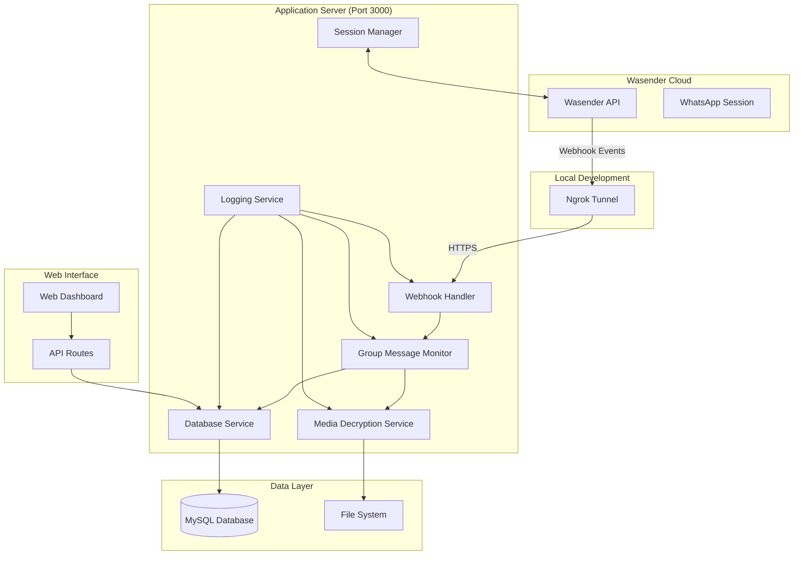
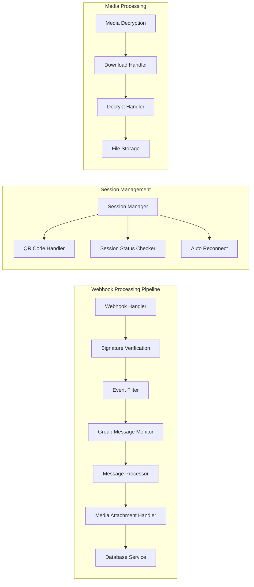

# Design Document

## Overview

The Wasender API Migration design transforms the current WhatsApp message capture system from a browser-based solution (whatsapp-web.js + Puppeteer) to a cloud-based API solution (Wasender API + Webhooks). This design focuses exclusively on group message monitoring, eliminating personal message processing, and implementing a robust webhook-based architecture with comprehensive logging and media handling.

## Architecture

### High-Level Architecture



### Component Architecture



## Components and Interfaces

### 1. Webhook Handler (`src/services/webhookHandler.js`)

**Purpose**: Receives and processes incoming webhooks from Wasender API

**Key Methods**:
```javascript
class WebhookHandler {
    async processWebhook(req, res)
    async verifySignature(payload, signature)
    async routeEvent(eventType, eventData)
    async handleMessageUpsert(messageData)
    async handleMessageUpdate(updateData)
    async handleSessionStatus(statusData)
}
```

**Interfaces**:
- Input: HTTP POST requests from Wasender API
- Output: Processed events to Group Message Monitor
- Error Handling: Comprehensive logging and graceful failure recovery

### 2. Group Message Monitor (`src/services/groupMessageMonitor.js`)

**Purpose**: Filters and processes only group messages, ignoring personal messages

**Key Methods**:
```javascript
class GroupMessageMonitor {
    async processMessage(messageData)
    async isGroupMessage(messageData)
    async extractGroupInfo(messageData)
    async extractUserInfo(messageData)
    async processAttachments(messageData)
}
```

**Group Message Detection Logic**:
```javascript
// Group messages have JID format: groupId@g.us
// Personal messages have JID format: phoneNumber@s.whatsapp.net
const isGroupMessage = (jid) => {
    return jid.endsWith('@g.us');
};
```

### 3. Media Decryption Service (`src/services/mediaDecryption.js`)

**Purpose**: Handles WhatsApp media decryption using Wasender API

**Key Methods**:
```javascript
class MediaDecryptionService {
    async decryptMedia(mediaUrl, mediaKey, mediaType)
    async downloadEncryptedFile(url)
    async decryptFile(encryptedData, mediaKey)
    async saveDecryptedFile(decryptedData, fileName)
    async validateMediaHash(data, expectedHash)
}
```

**Decryption Process**:
1. Download encrypted media from Wasender URL
2. Decrypt using AES-256-CBC with provided media key
3. Validate using SHA-256 hash
4. Save to file system with organized structure

### 4. Database Service (`src/services/databaseService.js`)

**Purpose**: Manages data persistence using new models

**Key Methods**:
```javascript
class DatabaseService {
    async saveGroupMessage(messageData, groupInfo, userInfo)
    async saveUserInfo(userInfo)
    async saveAttachment(attachmentData, postBankId)
    async checkDuplicateMessage(messageId)
    async updateMessageStatus(messageId, status)
}
```

**Data Mapping**:
```javascript
// WhatsApp Message -> PostBank Model
const mapToPostBank = (messageData) => ({
    postId: messageData.key.id,
    postSnippet: messageData.message.conversation || messageData.message.extendedTextMessage?.text,
    postTitle: messageData.message.conversation || 'WhatsApp Message',
    authorName: messageData.pushName || 'Unknown',
    authorUsername: messageData.key.participant || messageData.key.remoteJid,
    source: 'whatsapp',
    postTimestamp: new Date(messageData.messageTimestamp * 1000),
    channelId: messageData.key.remoteJid, // Group ID
    // ... other fields
});
```

### 5. Session Manager (`src/services/sessionManager.js`)

**Purpose**: Manages WhatsApp session via Wasender API

**Key Methods**:
```javascript
class SessionManager {
    async createSession(sessionName, phoneNumber)
    async getQRCode()
    async getSessionStatus()
    async connectSession()
    async disconnectSession()
    async handleSessionEvents(eventData)
}
```

**API Integration**:
```javascript
// Wasender API Endpoints
const WASENDER_ENDPOINTS = {
    createSession: 'POST /api/whatsapp-sessions',
    getQRCode: 'GET /api/whatsapp-sessions/:sessionId/qrcode',
    getStatus: 'GET /api/status',
    connect: 'POST /api/whatsapp-sessions/:sessionId/connect',
    disconnect: 'POST /api/whatsapp-sessions/:sessionId/disconnect'
};
```

### 6. Ngrok Tunnel Service (`src/services/ngrokService.js`)

**Purpose**: Manages ngrok tunnel for webhook development

**Key Methods**:
```javascript
class NgrokService {
    async startTunnel(port)
    async getTunnelUrl()
    async updateWebhookUrl(tunnelUrl)
    async stopTunnel()
    async monitorTunnelHealth()
}
```

## Data Models

### PostBank Model (Messages)
```javascript
// WhatsApp-specific fields in PostBank
{
    postId: 'WhatsApp Message ID',
    postSnippet: 'Message text content',
    postTitle: 'Message preview or "WhatsApp Message"',
    authorName: 'Sender display name',
    authorUsername: 'Sender phone number or JID',
    source: 'whatsapp',
    channelId: 'Group JID (groupId@g.us)',
    postTimestamp: 'Message timestamp',
    postType: 'text|image|video|audio|document',
    // New WhatsApp fields
    deviceSource: 'WhatsApp client info',
    isReply: 'Boolean for reply messages',
    inReplyToId: 'Original message ID if reply',
    // ... other existing fields
}
```

### CommonAttachment Model (Media Files)
```javascript
{
    post_bank_id: 'Foreign key to PostBank',
    attachment_type: 'image|video|audio|document',
    platform_name: 'whatsapp',
    image_attachment_path: 'Path for images',
    video_attachment_path: 'Path for videos',
    audio_attachment_path: 'Path for audio',
    document_attachment_path: 'Path for documents',
    mime_type: 'File MIME type',
    group_id: 'WhatsApp group ID',
    download_status: 'PENDING|SUCCESS|FAILED',
    processing_status: 'NOT_PROCESSED|PROCESSING|COMPLETED|FAILED'
}
```

### PostUser Model (User Information)
```javascript
{
    platform: 'whatsapp',
    platform_user_id: 'WhatsApp JID or phone number',
    username: 'Phone number',
    display_name: 'WhatsApp display name',
    profile_image_url: 'Profile picture URL if available',
    // WhatsApp-specific fields
    is_business: 'Boolean for business accounts',
    // ... other fields
}
```

## Error Handling

### Webhook Error Handling
```javascript
const webhookErrorHandler = {
    signatureVerificationFailed: (req, res) => {
        logger.error('Webhook signature verification failed', { 
            headers: req.headers,
            ip: req.ip 
        });
        res.status(401).json({ error: 'Unauthorized' });
    },
    
    processingError: (error, eventData) => {
        logger.error('Webhook processing error', { 
            error: error.message,
            stack: error.stack,
            eventData 
        });
        // Continue processing other events
    },
    
    mediaDecryptionError: (error, mediaData) => {
        logger.error('Media decryption failed', { 
            error: error.message,
            mediaUrl: mediaData.url,
            mediaType: mediaData.type 
        });
        // Mark attachment as failed but continue
    }
};
```

### Database Error Handling
```javascript
const databaseErrorHandler = {
    duplicateMessage: (messageId) => {
        logger.warn('Duplicate message ignored', { messageId });
        return { success: true, duplicate: true };
    },
    
    connectionError: (error) => {
        logger.error('Database connection error', { error: error.message });
        // Implement retry logic
        return retryDatabaseOperation();
    },
    
    constraintViolation: (error, data) => {
        logger.error('Database constraint violation', { 
            error: error.message,
            data 
        });
        // Handle gracefully without crashing
    }
};
```

## Testing Strategy

### Unit Testing
```javascript
// Test webhook signature verification
describe('WebhookHandler', () => {
    test('should verify valid Wasender signature', () => {
        const payload = JSON.stringify({ test: 'data' });
        const secret = 'test-secret';
        const signature = generateSignature(payload, secret);
        
        expect(webhookHandler.verifySignature(payload, signature, secret))
            .toBe(true);
    });
});

// Test group message filtering
describe('GroupMessageMonitor', () => {
    test('should identify group messages correctly', () => {
        const groupJid = '1234567890@g.us';
        const personalJid = '1234567890@s.whatsapp.net';
        
        expect(groupMessageMonitor.isGroupMessage(groupJid)).toBe(true);
        expect(groupMessageMonitor.isGroupMessage(personalJid)).toBe(false);
    });
});
```

### Integration Testing
```javascript
// Test end-to-end webhook processing
describe('Webhook Integration', () => {
    test('should process group message webhook to database', async () => {
        const webhookPayload = {
            event: 'messages.upsert',
            data: {
                messages: [{
                    key: { id: 'test-msg-id', remoteJid: 'group@g.us' },
                    message: { conversation: 'Test message' },
                    messageTimestamp: Date.now() / 1000
                }]
            }
        };
        
        await webhookHandler.processWebhook(webhookPayload);
        
        const savedMessage = await databaseService.getMessageById('test-msg-id');
        expect(savedMessage).toBeDefined();
        expect(savedMessage.source).toBe('whatsapp');
    });
});
```

### Load Testing
```javascript
// Test webhook endpoint performance
const loadTest = {
    concurrent_webhooks: 100,
    messages_per_second: 50,
    test_duration: '5 minutes',
    expected_response_time: '<100ms',
    expected_success_rate: '>99%'
};
```

## Configuration Management

### Environment Variables
```bash
# Wasender API Configuration
WASENDER_API_KEY=your_session_api_key
WASENDER_PERSONAL_ACCESS_TOKEN=your_account_token
WASENDER_WEBHOOK_SECRET=your_webhook_secret
WASENDER_BASE_URL=https://wasenderapi.com
WASENDER_SESSION_NAME=group_monitor_session

# Webhook Configuration
WEBHOOK_PORT=3000
WEBHOOK_PATH=/webhook/wasender
NGROK_AUTH_TOKEN=your_ngrok_token

# Database Configuration (existing)
DB_HOST=localhost
DB_USER=root
DB_PASSWORD=Sameer@123
DB_NAME=twitter_scrapper

# File Storage Configuration
ATTACHMENT_PATH=/Users/apple1/Downloads/WHATSAPP_DOCS/
MAX_FILE_SIZE=50MB
ALLOWED_MEDIA_TYPES=image,video,audio,document

# Logging Configuration
LOG_LEVEL=info
LOG_FILE_PATH=./logs/wasender-migration.log
LOG_ROTATION=daily
LOG_MAX_FILES=30
```

### Wasender API Configuration
```javascript
const wasenderConfig = {
    baseURL: process.env.WASENDER_BASE_URL,
    apiKey: process.env.WASENDER_API_KEY,
    personalAccessToken: process.env.WASENDER_PERSONAL_ACCESS_TOKEN,
    webhookSecret: process.env.WASENDER_WEBHOOK_SECRET,
    sessionName: process.env.WASENDER_SESSION_NAME,
    
    // Webhook events to subscribe to
    webhookEvents: [
        'messages.upsert',      // New messages
        'messages.update',      // Message updates
        'session.status',       // Session status changes
        'qrcode.updated'        // QR code updates
    ],
    
    // API endpoints
    endpoints: {
        sessions: '/api/whatsapp-sessions',
        qrcode: '/api/whatsapp-sessions/:sessionId/qrcode',
        status: '/api/status',
        decryptMedia: '/api/decrypt-media'
    }
};
```

## Security Considerations

### Webhook Security
```javascript
const securityMeasures = {
    signatureVerification: {
        algorithm: 'HMAC-SHA256',
        header: 'X-Webhook-Signature',
        secret: process.env.WASENDER_WEBHOOK_SECRET
    },
    
    rateLimiting: {
        windowMs: 15 * 60 * 1000, // 15 minutes
        max: 1000, // limit each IP to 1000 requests per windowMs
        message: 'Too many webhook requests'
    },
    
    ipWhitelist: [
        // Wasender API IP ranges (to be configured)
        '0.0.0.0/0' // Allow all for development
    ]
};
```

### Data Protection
```javascript
const dataProtection = {
    encryption: {
        mediaFiles: 'AES-256-CBC (handled by Wasender)',
        sensitiveData: 'Database level encryption for PII'
    },
    
    accessControl: {
        apiKeys: 'Environment variables only',
        webhookSecret: 'Secure random generation',
        databaseCredentials: 'Encrypted storage'
    },
    
    dataRetention: {
        messages: '1 year default',
        mediaFiles: '6 months default',
        logs: '30 days default'
    }
};
```

## Performance Optimization

### Webhook Processing
```javascript
const performanceOptimizations = {
    asyncProcessing: {
        webhookResponse: 'Immediate 200 OK response',
        messageProcessing: 'Background queue processing',
        mediaDecryption: 'Separate worker threads'
    },
    
    databaseOptimizations: {
        connectionPooling: 'MySQL connection pool',
        indexing: 'Proper indexes on postId, channelId, timestamp',
        batchInserts: 'Batch processing for multiple messages'
    },
    
    caching: {
        groupMetadata: 'Cache group info for 1 hour',
        userProfiles: 'Cache user data for 30 minutes',
        sessionStatus: 'Cache status for 5 minutes'
    }
};
```

### Resource Management
```javascript
const resourceManagement = {
    memoryUsage: {
        mediaBuffers: 'Stream processing for large files',
        messageQueues: 'Limited queue size with overflow handling',
        cacheSize: 'LRU cache with size limits'
    },
    
    fileSystem: {
        mediaStorage: 'Organized directory structure by date/group',
        cleanup: 'Automated cleanup of old files',
        compression: 'Compress old media files'
    }
};
```

This design provides a comprehensive architecture for migrating to Wasender API while focusing on group message monitoring, robust error handling, and scalable performance.